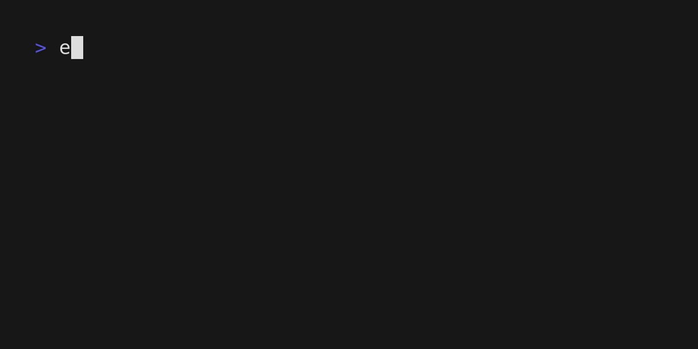

# Learning Café Penetration Test

## University of Winchester

Module: BS7204 Network Security and Penetration Testing
Lecturer: Rhys Lockley
Student: Peter Torkington, ID: 1902008

---

## Presentation Overview

1. Scope and Requirements
1. Vulnerability Analysis
1. Testing Methodology
1. Key Findings
1. Secure Design Recommendations
1. Conclusion

---

VHS GIF

---

VHS mp4
<video width="1200" height="600" controls>
  <source src="./img/demo.mp4" type="video/mp4">
  Your browser does not support the video tag.
</video>

---

asciinema embedded player

---

## Scope of the Learning Café

- **Systems Evaluated:**
  - Network infrastructure (wired & wireless)
  - Virtual Learning Environment (VLE)
  - Email services and academic databases
  - Online ordering system
  - Workstations and printers

- **Testing Constraints:**
  - Legal compliance (e.g., Computer Misuse Act 1990, GDPR).
  - Ethical guidelines (e.g., OWASP, BCS).

---

## Vulnerabilities Identified

- **Network Infrastructure:**
  - Weak segmentation.
  - Risks from public Wi-Fi.

- **Authentication & Access Control:**
  - Susceptibility to phishing.
  - Insecure BYOD connections.

- **Web-Based Applications:**
  - SQL Injection & Cross-Site Scripting (XSS).

- **Emerging Threats:**
  - AI-driven attacks.
  - Ransomware targeting educational institutions.

---

## Practical Evidence: Network Discovery

- **Tools Used:**
  - `nmap` for network mapping.
  - OpenVAS for vulnerability scanning.

- **Findings:**
  - Discovered devices: Metasploitable2, Metasploitable3, Debian server.
  - Total vulnerabilities:
    - High severity: 30.
    - Medium severity: 49.

---

## Practical Evidence: Exploits

- **Metasploitable2:**
  - FTP (ProFTPD): Remote Code Execution (CVE-2015-3306).
  - Telnet: Default credentials used to gain access.
  - Samba share: Uploaded malicious web shell.

- **Metasploitable3:**
  - Apache (mod_cgi): Exploited Shellshock vulnerability (CVE-2014-6271).
  - CUPS: Remote Code Execution.
  - Privilege escalation to root.

---

## Testing Methodology: NIST SP 800-115

1. **Planning:**
   - Define objectives, scope, and rules of engagement.
2. **Discovery:**
   - Active and passive reconnaissance.
3. **Attack:**
   - Exploiting vulnerabilities to validate findings.
4. **Reporting:**
   - Categorising vulnerabilities and proposing mitigations.

---

## Key Findings

- **Critical Vulnerabilities:**
  - FTP and Telnet on Metasploitable2.
  - Apache and CUPS on Metasploitable3.

- **Moderate Vulnerabilities:**
  - Samba shares enabling lateral movement.
  - MySQL misconfigurations.

- **Impact:**
  - Unauthorised access to sensitive systems.
  - Potential for university-wide compromise.

---

## Secure Design Recommendations

### Network Security
- Implement segmentation between public and private networks.
- Enforce WPA3 encryption for Wi-Fi.

### Authentication
- Use multi-factor authentication (MFA).
- Enforce password complexity and regular updates.

### Application Security
- Regular patching of software and systems.
- Conduct code reviews and dynamic testing.

---

## Secure Infrastructure

1. **Firewalls:**
   - Deploy stateful firewalls to limit unauthorised traffic.
2. **Endpoint Security:**
   - Install antivirus and endpoint detection tools.
3. **Monitoring & Alerts:**
   - Use SIEM systems for real-time threat detection.
4. **Training:**
   - Conduct regular user awareness programmes.

---

## Visual Evidence

### Screenshots:

- **Network Mapping:**
  - `nmap` output showcasing device discovery.
- **Vulnerability Scan:**
  - OpenVAS results highlighting critical vulnerabilities.
- **Exploitation Results:**
  - Screenshots of successful exploits.

---

## Countermeasure Justifications

### Addressed Vulnerabilities:

- **FTP:** Disable unencrypted FTP services.
- **Apache & CUPS:** Regular updates and secure configurations.
- **Telnet:** Replace with SSH for secure remote access.

### Infrastructure Enhancements:

- Harden BYOD policies.
- Introduce VLANs for network segmentation.

---

## Conclusion

- **Key Outcomes:**
  - Identified critical vulnerabilities in network and application layers.
  - Proposed actionable countermeasures for improvement.

- **Next Steps:**
  - Implement secure design recommendations.
  - Regularly review and update security practices.

---

## References

---

## Thank You

### Questions?

---

## Slide 1

- Item 1
- Item 2
- Item 3

---

## Slide 2

---

## Slide 3

> This is a quote.

---

## Slide 4

| Column 1 | Column 2 |
| -------- | -------- |
| Item 1   | Item 2   |
| Item 3   | Item 4   |

---

## Slide 5

## Left

- 1
- 2

## Right

- 3
- 4

---

## Slide 6

<i class="fa-brands fa-twitter"></i> Twitter: 
<i class="fa-brands fa-mastodon"></i> Mastodon: 
<i class="fa-brands fa-linkedin"></i> LinkedIn: 
<i class="fa fa-window-maximize"></i> Blog: 
<i class="fa-brands fa-github"></i> GitHub: 

---

# <!--fit--> Large Text

---

# Mermaid

graph TD;
    A-->B;
    A-->C;
    B-->D;
    C-->D;

