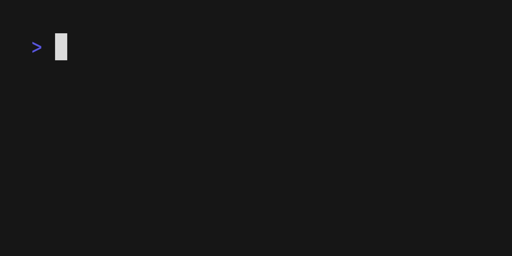

# Learning Café Penetration Test

## University of Winchester

Module: BS7204 Network Security and Penetration Testing
Lecturer: Rhys Lockley
Student: Peter Torkington, ID: 1902008

---

## Presentation Overview

pete - update this last

1. Scope and Requirements
1. Vulnerability Analysis
1. Testing Methodology
1. Key Findings
1. Secure Design Recommendations
1. Conclusion

---

## Penetration Testing Methodology Used: NIST SP 800-115

### 1. Planning

Define objectives, scope, and rules of engagement.

### 2. Discovery

Active and passive reconnaissance.

### 3. Attack

Exploiting vulnerabilities to validate findings.

### 4. Reporting

Categorising vulnerabilities and proposing mitigations.

---

## Scope of the Learning Café Network & Systems

- Network infrastructure (wired & wireless)
- Virtual Learning Environment (VLE)
- Email services and academic databases
- Online ordering system
- Workstations and printers

---

### Constraints

- Legal compliance (Computer Misuse Act 1990, DPA 2018)
- Ethical guidelines (NIST SP 800-115)
- Virtual environment (Metasploitable2 & Metasploitable3)

---

## Learning Café Vulnerabilities (1 of 2)

### Network Infrastructure

- Weak segmentation between public and private (UoW) networks
- Risks from public Wi-Fi access points

### Authentication & Access Control

- Susceptibility to phishing
- Insecure BYOD connections

---

## Learning Café Vulnerabilities (2 of 2)

### Web-Based Applications

- SQL Injection & Cross-Site Scripting (XSS)
- Apache

### Emerging Threats

- AI-driven attacks
- Ransomware targeting educational institutions.

---

## Practical Evidence

---

## Tools Used

### Network 

- `nmap` for network mapping
- OpenVAS for vulnerability scanning

## Exploits

- Metasploit Framework v6

### Findings

- Discovered devices: Metasploitable2, Metasploitable3, Debian
- Total vulnerabilities (OpennVAS):
  - High severity: 30.
  - Medium severity: 49.

---

## Practical Evidence: Exploits

### Metasploitable2

- FTP (ProFTPD): Remote Code Execution (CVE-2015-3306)
- Telnet: Default credentials used to gain access
- Samba share: Uploaded malicious web shell

### Metasploitable3

- Apache (mod_cgi): Exploited Shellshock vulnerability (CVE-2014-6271)
- CUPS: Remote Code Execution

---

## Key Findings

### Critical Vulnerabilities

- FTP and Telnet on Metasploitable2
- Apache and CUPS on Metasploitable3

### Moderate Vulnerabilities

- Samba shares
- MySQL misconfigurations

### Impact

- Unauthorised access to sensitive systems and data
- Potential for university-wide compromise

---

## Secure Design Recommendations

### Network Security

1. Implement segmentation between public and private networks.
1. Remove public access to Wi-fi, or create is as a stand-alone network routing to an new, independent  ISP.

### Authentication

1. Extend use of multi-factor authentication (MFA).
1. Enforce password complexity and regular updates.

### Application Security

1. Regular patching of software and systems.
1. Conduct code reviews and dynamic testing.

---

## Secure Infrastructure

### heading

1. kjhkjhkj
1. jhgsdfgjhgasd
1. jhgsdfgsdg

---

## Countermeasure Justifications

### Addressed Vulnerabilities:

- **FTP:** Disable unencrypted FTP services.
- **Apache & CUPS:** Regular updates and secure configurations.
- **Telnet:** Replace with SSH for secure remote access.

### Infrastructure Enhancements:

- Harden BYOD policies.
- Introduce VLANs for network segmentation.

---

## Conclusion

### Key Outcomes

- Identified critical vulnerabilities in network and application layers.
- Proposed actionable countermeasures for improvement.

### Next Steps

- Implement secure design recommendations.
- Regularly review and update security practices.

---

## References

Computer Misuse Act (1990). Statute Law Database Available at: [https://www.legislation.gov.uk/ukpga/1990/18/contents](https://www.legislation.gov.uk/ukpga/1990/18/contents).

Data Protection Act (2018). King’s Printer of Acts of Parliament Available at: [https://www.legislation.gov.uk/ukpga/2018/12/contents/enacted](https://www.legislation.gov.uk/ukpga/2018/12/contents/enacted).

Scarfone, K., Souppaya, M., Cody, A., and Orebaugh, A. (2021) NIST SP 800-115. NIST SP 800-115. Available at: [https://www.nist.gov/privacy-framework/nist-sp-800-115text](https://www.nist.gov/privacy-framework/nist-sp-800-115).

---

## Thank You

### Questions?

---

## Slide 1

- Item 1
- Item 2
- Item 3

---

## Slide 2

---

## Slide 3

> This is a quote.

---

## Slide 4

| Column 1 | Column 2 |
| -------- | -------- |
| Item 1   | Item 2   |
| Item 3   | Item 4   |

---

## Slide 5

## Left

- 1
- 2

## Right

- 3
- 4

---

## Slide 6

<i class="fa-brands fa-twitter"></i> Twitter: 
<i class="fa-brands fa-mastodon"></i> Mastodon: 
<i class="fa-brands fa-linkedin"></i> LinkedIn: 
<i class="fa fa-window-maximize"></i> Blog: 
<i class="fa-brands fa-github"></i> GitHub: 

---

# <!--fit--> Large Text

---

# Mermaid

graph TD;
    A-->B;
    A-->C;
    B-->D;
    C-->D;

