# Learning Café Penetration Test

## University of Winchester


Module: BS7204 Network Security and Penetration Testing
Lecturer: Rhys Lockley
Student: Peter Torkington, ID: 1902008

---

## Presentation Overview

1. Testing Methodology - NIST SP 800-115
2. Discovery Phase
3. Attack Phase
4. Reporting Phase
5. Conclusion
6. Questions
7. References

---

## Penetration Testing Methodology Used: NIST SP 800-115

### 1. Planning

Define objectives, scope, and rules of engagement.

### 2. Discovery

Active and passive reconnaissance.

### 3. Attack

Exploiting vulnerabilities to validate findings.

### 4. Reporting

Categorising vulnerabilities and proposing mitigations.

---

<script src="https://asciinema.org/a/45UBTj01G7Yf7Sz5dDxgh2iiN.js" id="asciicast-45UBTj01G7Yf7Sz5dDxgh2iiN" 
  async="true" 
  data-preload="true" 
  data-poster='npt:0:01' 
></script>

---

## Practical Evidence: Discovery Phase 1/3 - Address Range & Kali IP

Find the IP of Kali VM & the network address range: `ip addr`.

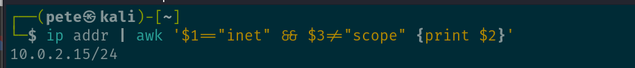

Discover devices on the network: `nmap -sn 10.0.2.1/24`

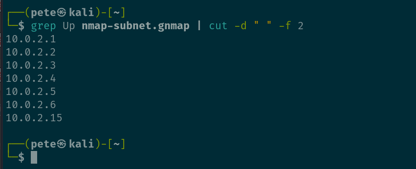

---

## Practical Evidence: Discovery Phase 2/3 - Vulnerabilities (OpenVAS)

OpenVAS scan results, summary & detailed:

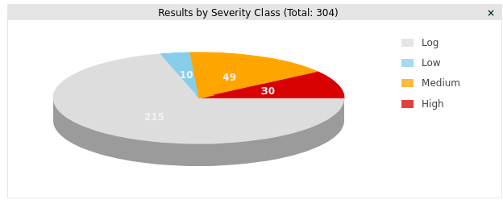

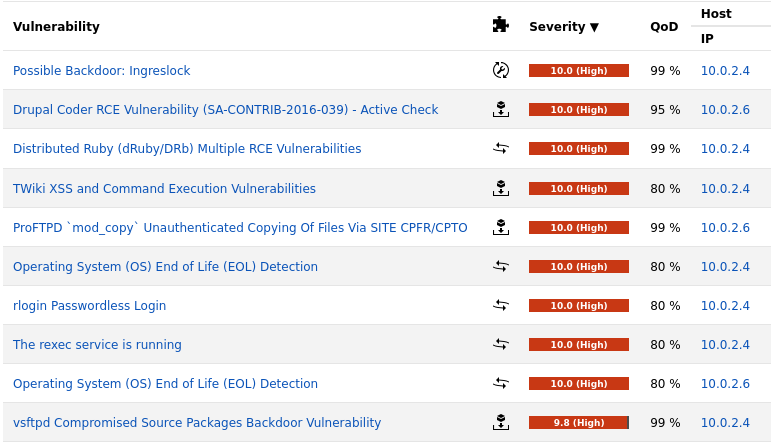

---

## Practical Evidence: Discovery Phase 3/3 - Vulnerabilities (nmap)

`nmap` ports & services scan results:

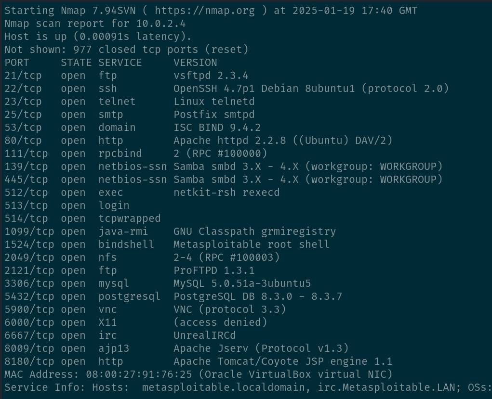

---

## Practical Evidence: Attack Phase - 1 of 8 - vsftpd v2.3.4 Backdoor (root)

Root access was obtained by exploiting a backdoor in vsftpd, version '2.3.4'.

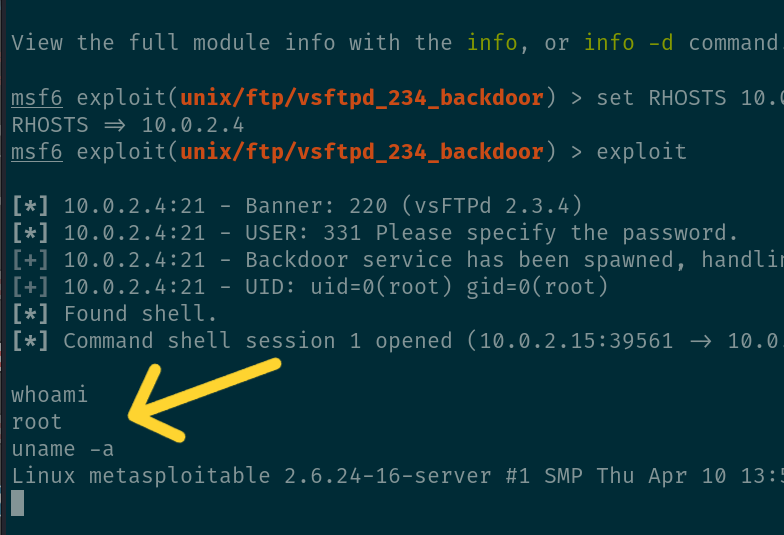

---

## Practical Evidence: Attack Phase - 2 of 8 - Samba (root)

Root access was obtained by exploiting Samba. Version '3.0.20-Debian' was identified, which is vulnerable to the username map script command execution exploit.

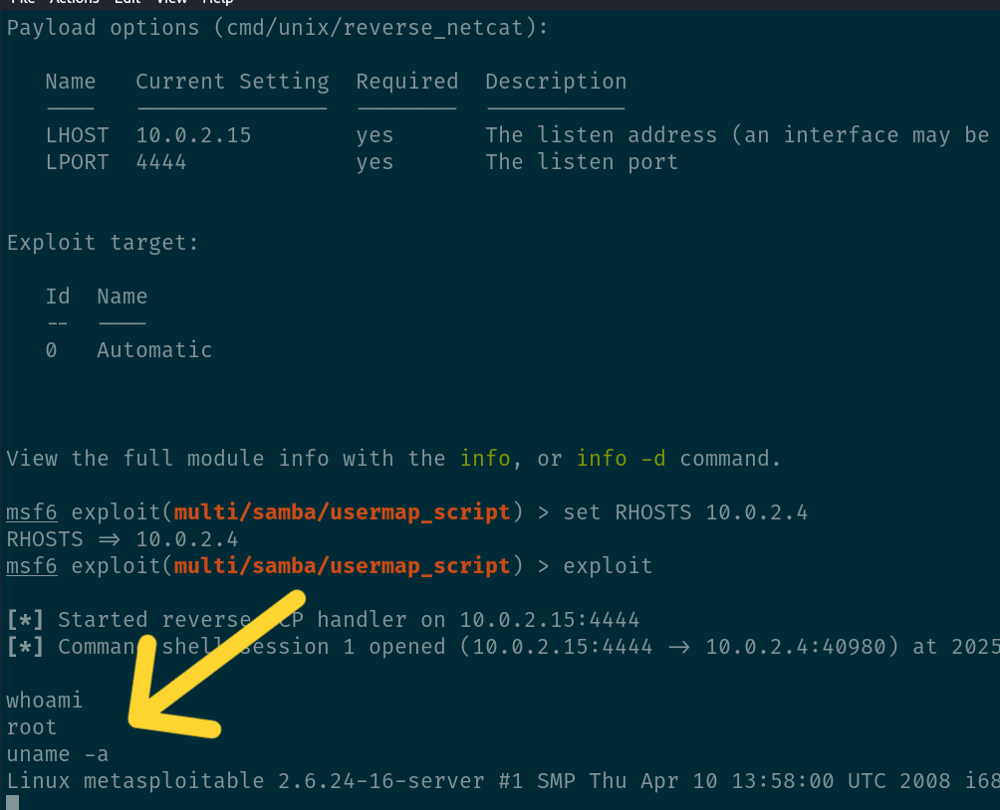

---

## Practical Evidence: Attack Phase - 3 of 8 - Unreal IRCd v3.2.8.1 (root)

Root access was obtained by exploiting a backdoor in unrealIRCd 'v3.2.8.1'.

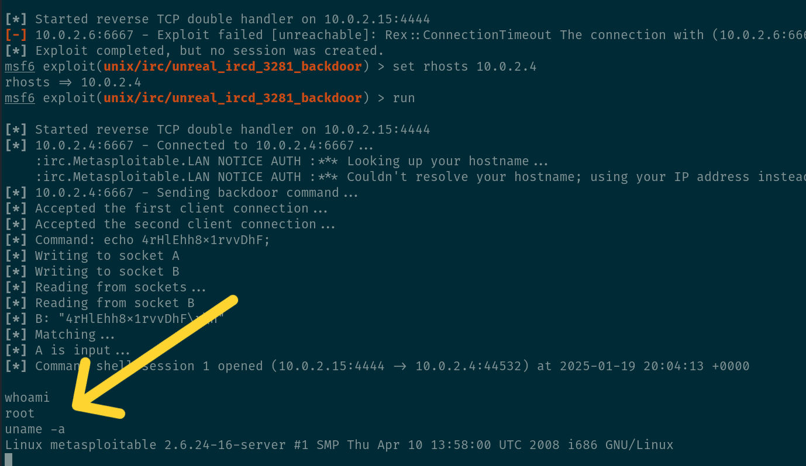

---

## Practical Evidence: Attack Phase - 4 of 8 - MySQL (root)

No tools required. Default credentials wre used, 'root:toor', failed. Tried 'root:null' (no password), success. Full access to all databases and tables.

```bash
mysql -u root -p -h 10.0.2.4 --ssl=off
```

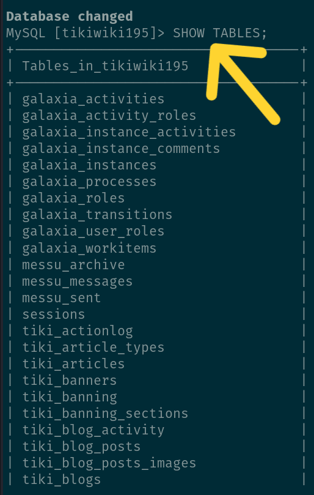

---

## Practical Evidence: Attack Phase - 5 of 8 - VNC Password Scanner (root)

Root access was obtained by exploiting a poorly configured VNC server. A password scanner module in Metasploite was used, attempting multiple passwords. Access was gained with a password of... 'password'.

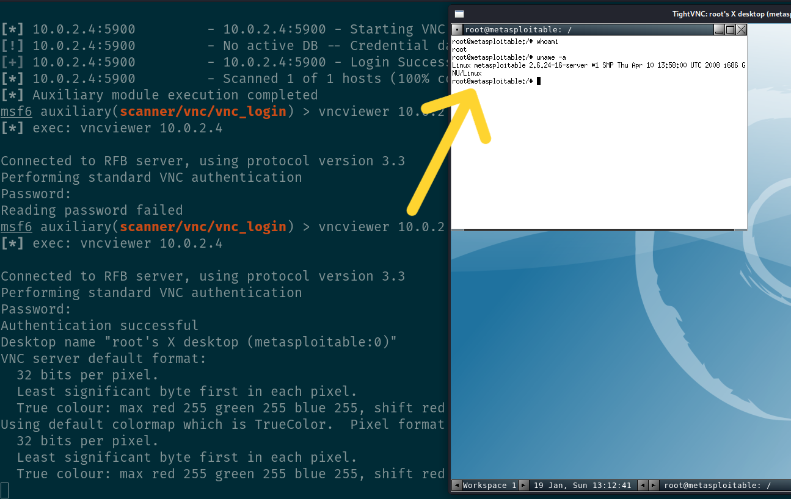

---

## Practical Evidence: Attack Phase - 6 of 8 - Telnet (root)

Root access was obtained by exploiting Telnet default credentials.

```bash
# default creds... msfadmin:msfadmin
telnet 10.0.2.4

# then switch to root...
sudo su -
```

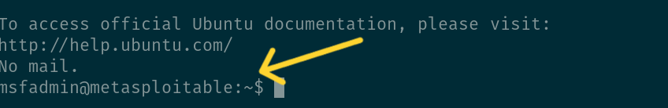

---

## Practical Evidence: Attack Phase - 7 of 8 - Apache v2.4.7

Access was obtained by remote code execution (RCE) vulnerability in Apache 'v2.4.7'.

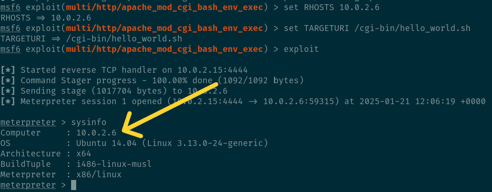

---

## Practical Evidence: Attack Phase - 8 of 8 - ProFTPD v1.3.5

Access was obtained by remote code execution (RCE) vulnerability in ProFTPD 'v1.3.5'.

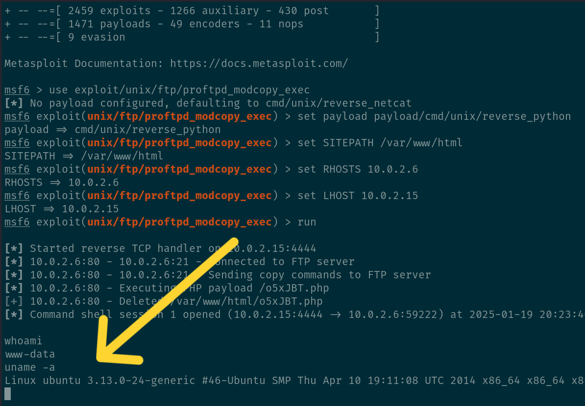

---

## Practical Evidence: Reporting Phase 1/2 - Countermeasures

| Vulnerability             | Countermeasure                                  |
| :------------------------ | :---------------------------------------------- |
| 1. vsftpd v2.3.4          | Upgrade to current version.                     |
| 2. Samba. Version '3.0.20 | Upgrade to current version.                     |
| 3. Unreal IRCd v3.2.8.1   | Upgrade to current version.                     |
| 4. MySQL                  | Replace blank password with secure pwd or keys. |
| 5. VNC                    | Replace weak password, or key-based             |
| 6. Telnet                 | Uninstall Telnet. Implement SSH.                |
| 7. Apache v2.4.7          | Upgrade to current version.                     |
| 8. ProFTPD v1.3.5         | Upgrade to current version.                     |

---

## Practical Evidence: Reporting Phase 2/2 - Secure Design

<div class="columns">
<div>

### Network

- VLANs for segmentation.
- Remove public Wi-Fi, or isolate it.

</div>
<div>

### Systems

- Migrate from self hosted to professionally hosted cloud services.
- Regularly patch OSs, applications, databases, web servers, and services.
- Authentication: change from passwords to key based, `passkeys`:
  - supported by the main identity providers: Microsoft, Google, Apple.
  - organisations that support passkeys include: GitHub, GitLab, AWS, Azure, Amazon, eBay, WordPress.

</div>
</div>

---

## Conclusion

### Key Outcomes

- Identified critical vulnerabilities in network and application layers.
- Proposed actionable countermeasures for improvement.

### Next Steps

- Implement secure design recommendations.
- Regularly review and update security practices.

## Thank You

### Questions?

---

## References

Computer Misuse Act (1990). Statute Law Database Available at: [https://www.legislation.gov.uk/ukpga/1990/18/contents](https://www.legislation.gov.uk/ukpga/1990/18/contents).

NIST (2014) NVD - cve-2014-6271. Available at: [https://nvd.nist.gov/vuln/detail/cve-2014-6271](https://nvd.nist.gov/vuln/detail/cve-2014-6271).

NIST (2015) NVD - CVE-2015-3306. Available at: [https://nvd.nist.gov/vuln/detail/CVE-2015-3306](https://nvd.nist.gov/vuln/detail/CVE-2015-3306).

Data Protection Act (2018). King’s Printer of Acts of Parliament Available at: [https://www.legislation.gov.uk/ukpga/2018/12/contents/enacted](https://www.legislation.gov.uk/ukpga/2018/12/contents/enacted).

Scarfone, K., Souppaya, M., Cody, A., and Orebaugh, A. (2021) NIST SP 800-115. NIST SP 800-115. Available at: [https://www.nist.gov/privacy-framework/nist-sp-800-115text](https://www.nist.gov/privacy-framework/nist-sp-800-115).

---
